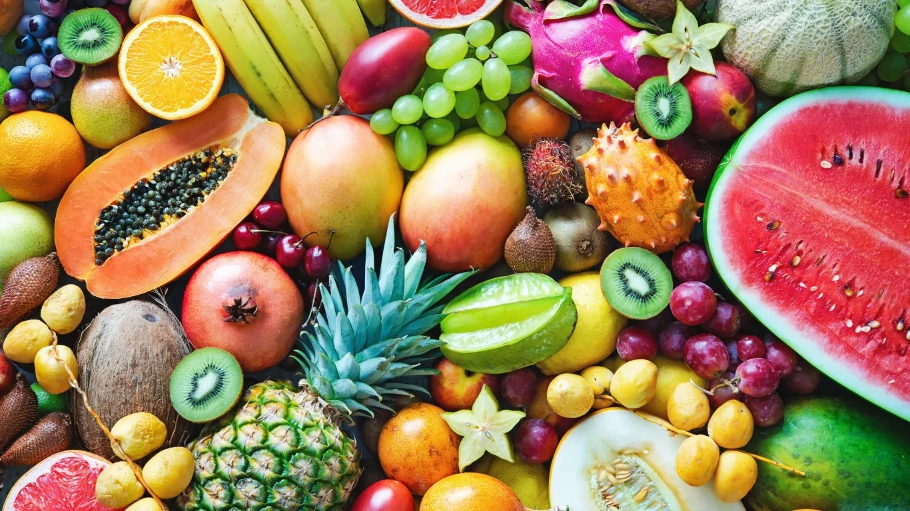
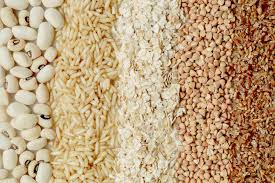
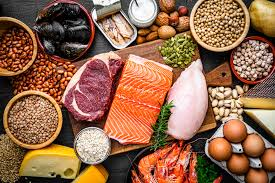

# Deploying MyPlate Food Groups as a Static Website on AWS S3

This guide will walk you through the steps required to host the MyPlate Food Groups page on AWS as a static website using an S3 bucket.

## Requirements

- An AWS account.
- Basic knowledge of HTML and AWS services.
- The MyPlate Food Groups HTML file and related image files (e.g., `fruits.jpg`, `vegetables.jpg`, etc.).

## Steps to Deploy the Static Website

### 1. Create an S3 Bucket

1. Log in to the [AWS Management Console](https://aws.amazon.com/console/).
2. Navigate to **S3** by typing "S3" in the search bar and selecting **S3** from the results.
3. Click on the **Create bucket** button.
4. Enter a unique bucket name (e.g., `myplate-static-website`).
5. Choose the appropriate AWS region.
6. In the **Block Public Access settings for this bucket**, uncheck **Block all public access** and confirm that you want to allow public access.
7. Scroll down and click **Create bucket**.

### 2. Configure Static Website Hosting

1. In the S3 dashboard, click on your newly created bucket.
2. Go to the **Properties** tab.
3. Scroll down to the **Static website hosting** section and click **Edit**.
4. Select **Enable** for static website hosting.
5. Under **Index document**, enter `index.html`.
6. Click **Save changes**.

### 3. Upload the Website Files

1. In the S3 bucket, go to the **Objects** tab and click **Upload**.
2. Upload your `index.html` file and all related image files (e.g., `fruits.jpg`, `vegetables.jpg`, etc.).
3. After uploading, make sure the `index.html` file and all images are publicly accessible:
   - Select each file, click **Actions**, then choose **Make public**.
   - Alternatively, you can apply a bucket policy to make all files in the bucket publicly accessible.

### 4. Set Bucket Policy (Optional)

You can apply a bucket policy to make the entire bucket publicly accessible. Follow these steps:

1. Go to the **Permissions** tab of your S3 bucket.
2. Scroll down to **Bucket Policy** and click **Edit**.
3. Paste the following policy, replacing `BUCKET_NAME` with the name of your bucket:

    ```json
    {
      "Version": "2012-10-17",
      "Statement": [
        {
          "Effect": "Allow",
          "Principal": "*",
          "Action": "s3:GetObject",
          "Resource": "arn:aws:s3:::BUCKET_NAME/*"
        }
      ]
    }
    ```

4. Click **Save changes**.

### 5. Access the Website

Once everything is set up, you can access your static website via the **Bucket website endpoint** URL:

1. Go to the **Properties** tab.
2. Scroll down to **Static website hosting**.
3. Copy the **Bucket website endpoint** URL. This is your website's public address.

## Sample HTML Code (index.html)

Below is the HTML code for the MyPlate Food Groups page:

```html
<!DOCTYPE html>
<html lang="en">
<head>
  <meta charset="UTF-8">
  <meta name="viewport" content="width=device-width, initial-scale=1.0">
  <title>MyPlate Food Groups</title>
  <style>
    body {
      font-family: Arial, sans-serif;
      text-align: center;
      background-color: #f4f4f4;
    }
    h1 {
      color: #4CAF50;
    }
    .plate {
      display: grid;
      grid-template-columns: 60% 40%;
      grid-template-rows: 60% 40%;
      width: 300px;
      height: 300px;
      margin: 50px auto;
      border: 5px solid #4CAF50;
      border-radius: 50%;
      position: relative;
    }
    .section {
      display: flex;
      align-items: center;
      justify-content: center;
      padding: 10px;
    }
    .section img {
      width: 100%;
      height: 100%;
      object-fit: cover;
      border-radius: 10px;
    }
    .grains {
      grid-column: 2 / 3;
      grid-row: 1 / 2;
    }
    .vegetables {
      grid-column: 1 / 2;
      grid-row: 1 / 2;
    }
    .fruits {
      grid-column: 1 / 2;
      grid-row: 2 / 3;
    }
    .protein {
      grid-column: 2 / 3;
      grid-row: 2 / 3;
    }
    .dairy {
      position: absolute;
      top: -30px;
      right: -30px;
      width: 80px;
      height: 80px;
      border-radius: 50%;
      overflow: hidden;
    }
    .dairy img {
      width: 100%;
      height: 100%;
      object-fit: cover;
    }
    p {
      margin: 10px 0;
    }
  </style>
</head>
<body>

  <h1>MyPlate Food Groups</h1>
  
  <div class="plate">
    <div class="section fruits">
      
    </div>
    <div class="section vegetables">
      
    </div>
    <div class="section grains">
      
    </div>
    <div class="section protein">
      
    </div>
    <div class="dairy">
      
    </div>
  </div>

  <h2>The Five Food Groups</h2>
  <div>
    <p><strong>Fruits:</strong> Examples include apples, bananas, berries, and oranges. Fruits provide essential vitamins and fiber.</p>
    
    <p><strong>Vegetables:</strong> Examples include spinach, carrots, broccoli, and peas. Vegetables are rich in nutrients and fiber.</p>
    
    <p><strong>Grains:</strong> Examples include bread, rice, pasta, and oats. Grains provide carbohydrates for energy.</p>
    
    <p><strong>Protein:</strong> Examples include meat, poultry, fish, beans, and nuts. Protein helps build and repair tissues.</p>
    
    <p><strong>Dairy:</strong> Examples include milk, cheese, and yogurt. Dairy provides calcium and supports bone health.</p>
  </div>

</body>
</html>